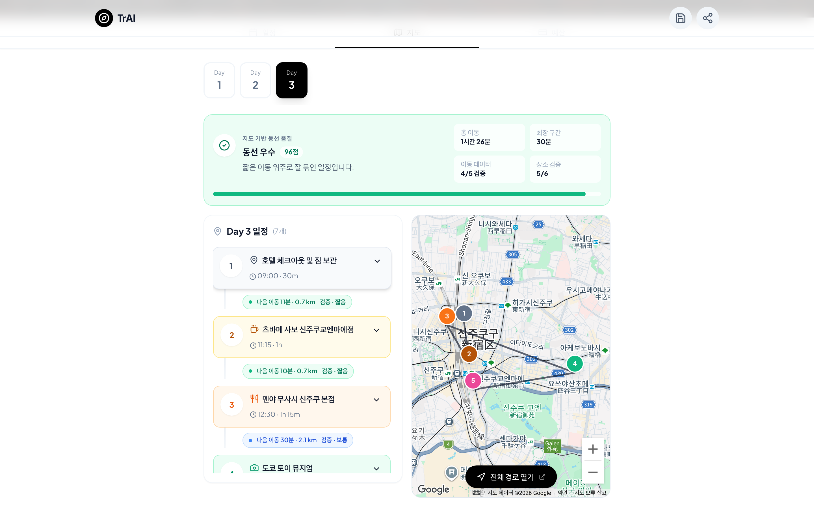

# ✈️ TrAI — AI 여행 플래너

> 국내든 해외든, 여행지·날짜·이동수단만 고르면 AI 멀티 에이전트가 일자별 동선부터 예산·지도까지 완성된 여행 일정을 만들어주는 서비스입니다.


---

## 🖼️ 미리보기




<table>
  <tr>
    <td width="50%"></td>
    <td width="50%"></td>
  </tr>
  <tr>
    <td align="center"><sub>여행 설정 1단계 · 국내/해외 선택과 여행지 입력</sub></td>
    <td align="center"><sub>로그인 (이메일 · Google)</sub></td>
  </tr>
</table>

---

## 💡 어떤 서비스인가요?

여행 계획은 교통·숙소·동선·예산을 동시에 맞춰야 하는 복잡한 퍼즐입니다. TrAI는 이 과정을 대화형 입력 몇 번으로 줄였습니다.

1. **입력** — 국내/해외를 고르고 여행지와 날짜를 입력합니다. 국내는 **항공·기차·버스·자차** 중 이동수단을 고르고, 해외는 항공편을 확인합니다. 예약해 둔 숙소, 꼭 가고 싶은 장소, 여행 컨셉(맛집·자연/힐링·알찬 일정 등 **최대 3개 조합**)과 현지 렌터카 이용 여부까지 5단계로 입력합니다. 아직 여행지를 못 정했다면 취향·시기 기반 AI 여행지 추천을 받을 수도 있습니다.
2. **생성** — AI 에이전트들이 일자별 분 단위 일정을 만들고, 모든 장소를 실제 좌표로 검증하고, 예산을 집계합니다. 먼저 완성된 날짜부터 화면에 실시간으로 흘러 들어옵니다.
3. **확인 & 활용** — 일정·지도·예산 3개 탭에서 결과를 확인합니다. 지도에서는 하루 동선이 번호 마커와 경로선으로 그려지고, 이동시간 실측값과 동선 품질 점수가 함께 표시됩니다. 완성된 일정은 저장하고, 공개 URL로 공유하거나 Google 캘린더·`.ics`로 내보낼 수 있습니다. 홈의 추천 일정에는 **다른 사용자들이 실제로 공유한 여행**이 랜덤으로 소개됩니다.

---

## 🛠️ 어떻게 만들었나요?

### 멀티 에이전트 파이프라인

일정 생성은 하나의 거대한 프롬프트가 아니라, 역할이 다른 5개 에이전트의 협업으로 설계했습니다. `POST /api/plan-trip` SSE 엔드포인트가 전체 흐름을 스트리밍합니다.

```
              ┌──────────────┐
  UserInput → │ 1. Intent    │  국내/해외·이동수단·기간·계절·예산 수준 분석 (로컬)
              └──────┬───────┘
          ┌──────────┴──────────┐  서로 독립 → 병렬 실행
          ▼                     ▼
   ┌─────────────┐       ┌─────────────┐
   │ 2. Transport│       │ 3. Hotel    │  교통편(항공·기차·버스·자차) /
   └──────┬──────┘       └──────┬──────┘  숙소 거점 확정
          └──────────┬──────────┘
                     ▼
              ┌──────────────┐
              │ 4. Route     │  일자별 상세 일정 — 날짜별 병렬 생성,
              └──────┬───────┘  완성되는 날짜부터 즉시 스트리밍
                     ▼
              ┌──────────────┐
              │ 5. Budget    │  총예산 검증 → 초과 시 동선 재조정
              └──────────────┘
```

원칙은 **"AI는 꼭 필요한 곳에만"** 입니다. 구조화된 입력 해석(Intent)과 예산 검증(Budget)은 규칙 기반 로컬 로직으로 처리하고, 주요 노선·국내 여행지 정보는 로컬 테이블을 먼저 씁니다. 실제 LLM(`gpt-5.4-mini`)이 도는 곳은 창의성이 필요한 일정 생성과, 로컬 데이터가 없을 때의 폴백(미등록 여행지의 교통편·요금 추정 등)뿐입니다.

### 국내여행과 4가지 이동수단

해외+항공 전용이던 파이프라인을 국내여행까지 확장하면서, 어떤 여행지든 동일한 경험을 갖도록 설계했습니다.

- **이동수단 통일** — 모든 국내 여행지에서 항공·기차·버스·자차 4가지를 동일하게 선택 가능. 주요 여행지는 로컬 테이블(노선·소요시간·요금)로 즉시 구성하고, 미등록 여행지는 AI가 실운행 노선 기준으로 추정(예: 평창 → 동서울터미널발 시외버스)
- **이동수단별 일정 템플릿** — 첫날은 KTX 탑승/국내선/자차 출발로, 마지막 날은 귀경 편으로 시작·마무리되도록 모드별 프롬프트 분기. "이미 현지에 있는" 마지막 날에 상행 교통편이 끼어드는 환각은 가드 프롬프트로 차단
- **렌터카 지원** — 항공·기차·버스로 이동하는 여행에 현지 렌터카 옵션을 더하면, 일정에 픽업·반납 활동이 자동 배치되고 하루 동선이 차량 기준(넓은 반경·주차 편의)으로 짜입니다

### 일정 품질 — 프롬프트 설계

"그럴듯한 일정"이 아니라 "실제로 따라갈 수 있는 일정"을 목표로 Route 에이전트의 프롬프트를 다듬었습니다.

- **달력 컨텍스트** — 각 일차의 실제 날짜·요일·계절을 계산해 전달. 월요일이면 휴관 명소를 피하고, 한여름이면 한낮 야외 도보를 줄이는 식으로 반영
- **실존 장소 검증** — 현재 운영 중인 실제 장소만 편성하도록 명시하고, 생성 후에는 Google Places로 전 좌표를 재검증
- **쓸모 있는 설명** — 활동 설명을 키워드 나열 대신 "매력 포인트 + 실용 팁(대표 메뉴, 예약 필요 여부, 덜 붐비는 시간대)" 한 문장으로 생성
- **예산 선반영** — 예산 검증 단계의 하루 활동비 한도를 생성 단계에 미리 전달해, 예산 초과로 인한 재생성 루프를 줄임
- **중복 편성 방지** — 날짜별 병렬 생성의 부작용(같은 명소가 여러 날 등장)을 must-visit 사전 배정 + 생성 후 교차 중복 제거로 해결

### 체감 속도 최적화

"생성 버튼을 누르고 얼마나 기다리는가"를 집요하게 줄였습니다. 단계별 계측(`measureStage`)으로 병목을 실측하면서:

- **병렬화** — Transport·Hotel 동시 실행, Route는 N일을 날짜별로 병렬 생성
- **일자별 점진 스트리밍** — 여행 메타(`trip-meta`)로 결과 화면 골격을 먼저 그리고, 완성되는 날짜부터 `day-result` 이벤트로 흘려보냄. **Day 1이 준비되면 전체 완성을 기다리지 않고 결과 화면으로 전환**
- **선(先)결과 · 후(後)보강** — 지도 좌표·이동시간 검증은 결과 전송을 막지 않고 `enrichment` 이벤트로 이어서 반영, 대표 이미지도 백그라운드 로드
- **숨은 버그 사냥** — 예산 계산에 `NaN`이 전파되어 매번 불필요한 재생성(+5초)이 돌던 버그를 실측 중에 발견·수정

이 과정으로 초기 응답 체감 대기를 **최대 13초대 → 6초대**로 줄였습니다.

### 지도 정확도와 인터랙티브 렌더링

AI가 만든 일정은 "장소 이름 문자열"일 뿐이라, 지도에 올리려면 검증 계층이 필요했습니다.

- **장소 검증** — 주소 변환용 Geocoding 대신 POI 자연어 검색에 강한 **Places API (New) Text Search**를 사용하고, 목적지 좌표 `locationBias`로 동명의 다른 도시 장소 매칭을 방지 (실측 검증률 100%)
- **이동시간** — Directions API로 구간별 실측, transit 미제공 환경을 위한 도보·차량 폴백(자차·렌터카 여행은 차량 우선), 24시간 인메모리 캐시로 반복 호출 절감
- **동선 품질 점수** — 총 이동시간·최장 구간·검증률을 종합해 하루 동선을 `우수/양호/부담`으로 평가, 실측·추정 데이터를 구분 표시
- **인터랙티브 지도** — iframe 임베드에서 **Maps JavaScript API**(`@vis.gl/react-google-maps`)로 전환. 활동 타입별 색상 번호 마커, 동선 폴리라인, 타임라인 카드 ↔ 마커 양방향 포커스 연동
- **키 보안** — 브라우저 노출 키는 무료 JS API 전용(리퍼러 제한), 유료 API는 서버 전용 키로 분리

### 그 외 설계 포인트

- **SPA 내비게이션** — Next.js App Router 위에서 `?view=` URL 동기화로 화면을 전환하는 단일 페이지 구조, 화면별 지연 로딩. 홈에서 새 여행을 시작하면 이전 입력이 전부 초기화되는 깨끗한 시작 보장
- **상태 관리** — Zustand 단일 스토어(`tripStore`)가 SSE 수신·일정 편집·저장/공유 상태를 관장
- **데이터** — Firebase Auth(이메일·Google) + Firestore(개인 일정 / 공개 공유 일정 분리). Firestore가 거부하는 `undefined` 필드는 초기화 옵션 + 직렬화 정제의 이중 방어로 차단
- **검증 문화** — 모든 성능·정확도·프롬프트 개선은 실제 파이프라인 실측과 브라우저 자동화(Playwright)로 before/after를 확인하고 반영

---

## 🧰 기술 스택

**Frontend** — Next.js 16 (App Router) · React 19 · TypeScript · Tailwind CSS · Zustand · @vis.gl/react-google-maps

**Backend / AI** — Next.js Route Handlers · OpenAI GPT (`gpt-5.4-mini`) · Server-Sent Events · Firebase Auth / Firestore

**External APIs** — Google Maps Platform (Places · Geocoding · Directions · Maps JavaScript) · Unsplash

---

## 🙏 크레딧

[Next.js](https://nextjs.org/) · [OpenAI](https://openai.com/) · [Google Maps Platform](https://developers.google.com/maps) · [Firebase](https://firebase.google.com/) · [Tailwind CSS](https://tailwindcss.com/) · [Lucide Icons](https://lucide.dev/) · [Unsplash](https://unsplash.com/)
