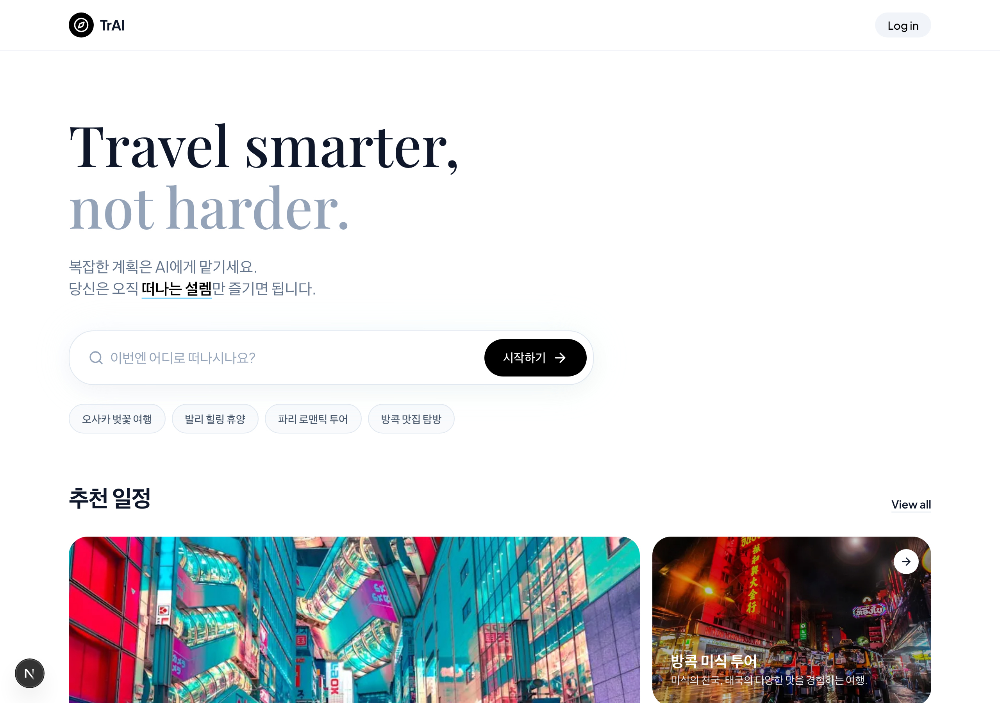
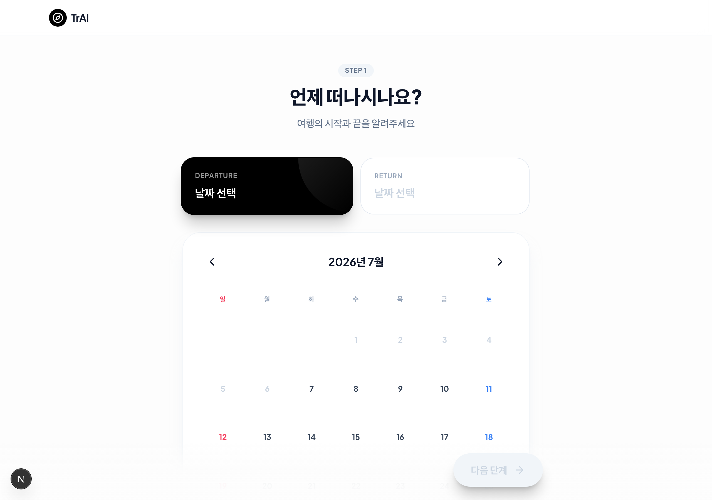
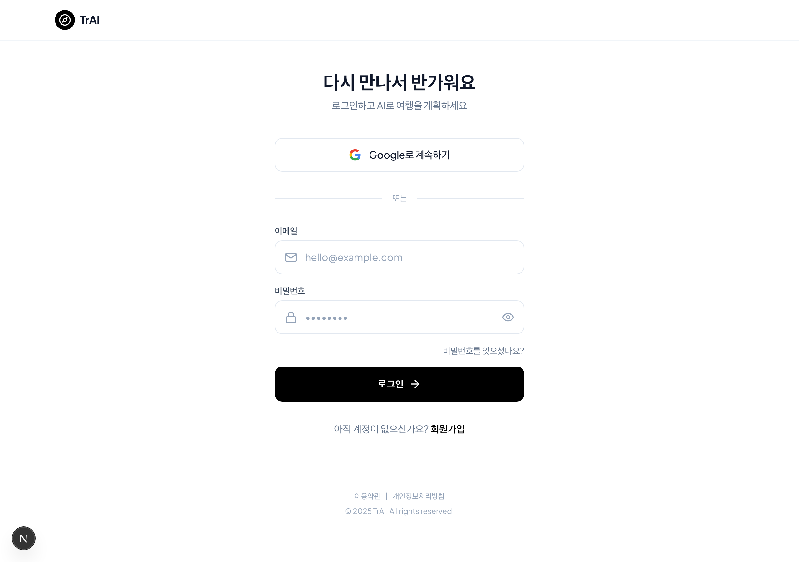

# ✈️ A2A Travel Planner

> AI 멀티 에이전트가 설계하는 스마트 여행 계획 서비스

여행지·항공편·숙소 정보만 입력하면, 여러 AI 에이전트가 협력해 **일자별 동선, 예산, 지도 경로까지** 완성된 여행 일정을 자동으로 만들어 줍니다. 생성된 일정은 편집·재생성·저장·공유·캘린더 내보내기까지 한 흐름에서 처리됩니다.


---

## 🖼️ 미리보기



<table>
  <tr>
    <td width="50%"></td>
    <td width="50%"></td>
  </tr>
  <tr>
    <td align="center"><sub>여행 설정 · 1단계 날짜 선택</sub></td>
    <td align="center"><sub>로그인 (이메일 · Google)</sub></td>
  </tr>
</table>

---

## 🎯 핵심 특징

- **멀티 에이전트 파이프라인** — 5개의 전문 에이전트가 순차·병렬로 협력해 일정을 생성합니다.
- **점진적 스트리밍(SSE)** — 진행 상황을 실시간으로 보여주고, 완성된 일정을 먼저 띄운 뒤 지도 좌표·이동시간·대표 이미지를 백그라운드에서 채워 체감 속도를 높였습니다.
- **로컬 우선(Local-first) 최적화** — 자주 쓰는 목적지·항공 노선·구조화된 입력값은 AI 호출 없이 로컬 데이터로 즉시 처리하고, 불확실한 정보만 AI로 보완합니다.
- **지도 기반 동선 검증** — Google Maps 지오코딩/경로 API로 실제 좌표와 대중교통 이동시간을 확인하고, 하루 동선의 품질을 점수화합니다.
- **부분 재생성** — 마음에 안 드는 하루 또는 개별 활동만 골라 "더 저렴하게 / 여유롭게 / 알차게" 다시 생성할 수 있습니다.
- **저장·공유·내보내기** — Firebase에 일정을 저장하고, 공개 URL로 공유하거나 Google 캘린더 / `.ics`로 내보냅니다.

---

## 🤖 AI 멀티 에이전트 파이프라인

여행 생성 요청은 `POST /api/plan-trip` **Server-Sent Events** 엔드포인트로 스트리밍 처리됩니다.

```
              ┌──────────────┐
  UserInput → │ 1. Intent    │  취향·기간·계절·예산 수준 분석 (로컬)
              └──────┬───────┘
                     │
          ┌──────────┴──────────┐   Intent만 있으면 서로 독립 → 병렬 실행
          ▼                     ▼
   ┌─────────────┐       ┌─────────────┐
   │ 2. Flight   │       │ 3. Hotel    │  항공 노선 / 숙소 거점 확정
   └──────┬──────┘       └──────┬──────┘
          └──────────┬──────────┘
                     ▼
              ┌──────────────┐
              │ 4. Route     │  일자별 상세 일정 (하루 단위 병렬 생성)
              └──────┬───────┘
                     ▼
              ┌──────────────┐
              │ 5. Budget    │  총예산 검증 → 초과 시 동선 1회 재조정
              └──────┬───────┘
                     ▼
        result 이벤트 (완성 일정 즉시 전송)
                     ▼
        enrichment 이벤트 (지도 좌표·이동시간 보강)
```

| 에이전트 | 역할 | 처리 방식 |
| --- | --- | --- |
| **1. Intent** (`intent.ts`) | 목적지 정규화(예: `tokyo → 도쿄`), 날짜로 기간·계절 계산, 여행 스타일 기반 테마·예산 수준 도출 | **완전 로컬** (AI 호출 없음) |
| **2. Flight** (`flight.ts`) | 항공 노선·소요시간·항공사 확정, 사용자가 입력한 가격 유지 | 주요 노선은 **로컬 테이블**, 미등록 목적지만 `gpt-5-nano` |
| **3. Hotel** (`hotel.ts`) | 숙소 거점(동선 기준점) 확정 및 좌표 검증 | 사용자 지정 숙소는 **지오코딩만**, 미지정 시 `gpt-5-nano` 추천 |
| **4. Route** (`route.ts`) | 일자별 분 단위 일정 생성 — 항공/입국/체크인 로직, 지역 클러스터링 | `gpt-5-mini`, **날짜별 병렬 호출** |
| **5. Budget** (`budget.ts`) | 항공+숙박+활동비 집계 및 예산 한도 검증, 초과 시 동선 재조정 제안 | **규칙 기반** (AI 호출 없음) |

### ⚡ 성능·체감 속도 최적화

- **Flight + Hotel 병렬화** — 두 단계는 Intent 결과만 있으면 서로 독립적이므로 `Promise.all`로 동시에 실행합니다.
- **Route 날짜별 병렬 생성** — N일 일정을 하루씩 병렬로 요청해 전체 생성 시간을 단축합니다.
- **선(先)결과 · 후(後)보강** — 완성된 일정을 `result` 이벤트로 먼저 내려 결과 화면을 즉시 띄우고, Google Maps 좌표·이동시간은 `enrichment` 이벤트로, 대표 이미지(Unsplash)는 백그라운드에서 이어서 채웁니다.
- **단계별 계측** — `measureStage()`가 각 에이전트 소요 시간을 로깅해 병목을 추적합니다.

**SSE 이벤트 타입**: `progress` (단계 진행) · `result` (완성 일정) · `enrichment` (지도 보강) · `error`

---

## 🗺️ 지도 동선 & 품질 점수

- **지오코딩 & 이동시간** (`lib/utils/googleMaps.ts`) — 각 장소를 Google Geocoding으로 검증하고, 인접 장소 간 대중교통 이동시간을 Directions API로 계산합니다.
- **인메모리 캐시** — 지오코딩·경로 결과를 **24시간 TTL / 최대 500건**으로 캐싱해 반복 요청 시 외부 API 호출과 비용을 줄입니다.
- **동선 품질 점수** (`lib/utils/routeQuality.ts`) — 하루 동선을 `동선 우수 / 양호 / 부담`으로 평가합니다. 이동시간 실측값이 없으면 **좌표 거리 → 일정 시간표 → 지역 동일성** 순으로 추정 소스를 단계적으로 적용하고, 실측/추정 구간을 구분해 표시합니다.

---

## ✨ 일정 편집 & 부분 재생성

생성된 일정은 정적인 결과가 아니라 계속 다듬을 수 있습니다. `POST /api/regenerate-day`가 다음을 지원합니다.

- **하루 통째로 재생성** — `balanced` / `cheaper`(더 저렴하게) / `relaxed`(더 여유롭게) / `fuller`(더 알차게) 모드
- **개별 활동 교체** (`replace-activity`) — 앞뒤 동선과 시간대를 유지하면서 한 장소만 대안으로 교체
- 재생성 결과도 즉시 지도 검증을 거쳐 좌표·이동시간이 반영됩니다.

---

## 🧭 사용자 여정 (화면 구성)

SPA 방식으로 `src/app/page.tsx`의 `currentScreen` 상태와 `?view=<screen>` URL이 동기화되며, 브라우저 뒤로가기를 지원합니다. 화면은 `next/dynamic`으로 지연 로딩됩니다.

| 화면 | 설명 |
| --- | --- |
| **home** | 여행지 검색 및 AI 여행지 추천 모달(`/api/recommend-destination`) |
| **setup** | 4단계 입력 — ① 날짜 ② 항공편 ③ 숙소 ④ 꼭 가고 싶은 장소 (단계별 유효성 검증) |
| **loading** | 에이전트 진행 상황 실시간 표시 |
| **result** | 일정 / 지도 / 예산 3개 탭 뷰 + 동선 품질 요약 |
| **detail** | 장소별 상세 정보 |
| **edit** | 일정 편집 및 AI 재생성 |
| **share** | 공개 URL 복사, Google 캘린더·`.ics` 내보내기 |
| **mytrips** | 저장한 여행 목록 관리 |
| **shared** | 공유 링크로 열람하는 읽기 전용 뷰어 |
| **login / signup** | 이메일·Google 로그인 |

### 여행 취향 입력

단순 목적지 외에도 세밀한 선호를 반영합니다 — **여행 스타일**(저비용·여유·알찬 일정·맛집·문화/역사·자연/힐링·쇼핑), **일정 밀도**, **비용 성향**, **이동 성향**. 이 값들은 Route 에이전트 프롬프트와 Budget 한도 계산에 함께 반영됩니다.

---

## 🔐 인증 & 데이터 저장

- **Firebase Authentication** — 이메일/비밀번호 및 Google OAuth
- **Cloud Firestore**
  - `users/{userId}/trips/{tripId}` — 사용자별 저장 일정 (인증 필요)
  - `shared_trips/{shareId}` — 공개 읽기 전용 공유 일정
- Firebase 모듈은 스토어 액션 내부에서 **동적 import**되어 서버 번들에 포함되지 않습니다.
- 아이콘(`ReactNode`) 필드는 저장 전에 제거되어 Firestore에는 순수 데이터만 저장됩니다.

---

## 🛠️ 기술 스택

**Frontend** · Next.js 16 (App Router) · React 19 · TypeScript 5 · Tailwind CSS 3.4 · Zustand 5 (상태 관리) · Lucide React (아이콘) · react-datepicker

**Backend / AI** · Next.js Route Handlers · OpenAI GPT (`gpt-5-nano`, `gpt-5-mini`) · Server-Sent Events 스트리밍 · Firebase Auth · Cloud Firestore

**External APIs** · OpenAI API · Google Maps (Geocoding / Directions) · Unsplash

### 상태 관리 구조

`src/stores/tripStore.ts`가 단일 진실 공급원(single source of truth)입니다.

- `userInput` — 여행 선호·항공·숙소·필수 방문지
- `tripData` · `scheduleData` · `budgetData` — AI 생성 결과
- `currentTripId` · `savedTrips` · `currentShareId` — 저장/공유 상태
- `isGenerating` · `isRegeneratingSchedule` · `regeneratingDay` · `regeneratingActivityId` — 로딩 상태
- 활동 편집 시 `buildBudgetFromSchedule()`가 예산 총액을 재계산합니다.

---

## 📁 프로젝트 구조

```
src/
├── app/
│   ├── api/
│   │   ├── plan-trip/route.ts             # 5-에이전트 파이프라인 (SSE)
│   │   ├── regenerate-day/route.ts        # 하루/활동 부분 재생성
│   │   └── recommend-destination/route.ts # AI 여행지 추천
│   ├── layout.tsx
│   └── page.tsx                           # SPA 라우팅 허브
│
├── components/
│   ├── providers/AuthProvider.tsx
│   ├── screens/                           # 화면 단위 컴포넌트
│   │   ├── home/  setup/  loading/  result/
│   │   ├── detail/  edit/  share/  shared/
│   │   ├── trips/  auth/
│   │   └── result/ (ScheduleTab · MapTab · BudgetTab)
│   └── ui/                                # 공통 UI (Header, DatePicker 등)
│
├── constants/                            # 공항·초기 데이터
├── lib/
│   ├── agents/                           # AI 에이전트
│   │   ├── intent.ts  flight.ts  hotel.ts
│   │   ├── route.ts   budget.ts   recommend.ts
│   ├── firebase.ts
│   └── utils/
│       ├── googleMaps.ts                 # 지오코딩·경로 + 캐시
│       ├── routeQuality.ts               # 동선 품질 점수
│       ├── travelStyle.ts                # 여행 스타일 옵션·프롬프트
│       └── format.ts  iconHelpers.ts  typeHelpers.ts  unsplash.ts
│
├── stores/                               # tripStore · authStore
└── types/                                # trip.ts · api.ts
```

---

## 🚀 시작하기

### 1. 클론 & 설치

```bash
git clone https://github.com/icebear0111/a2a-travel-planner.git
cd a2a-travel-planner
npm install
```

### 2. 환경 변수 설정

프로젝트 루트에 `.env.local`을 만들고 다음 값을 채웁니다.

```env
# OpenAI
OPENAI_API_KEY=your_openai_api_key

# Google Maps (Geocoding / Directions)
NEXT_PUBLIC_GOOGLE_MAPS_KEY=your_google_maps_api_key

# Unsplash
NEXT_PUBLIC_UNSPLASH_ACCESS_KEY=your_unsplash_access_key

# Firebase
NEXT_PUBLIC_FIREBASE_API_KEY=your_firebase_api_key
NEXT_PUBLIC_FIREBASE_AUTH_DOMAIN=your_project.firebaseapp.com
NEXT_PUBLIC_FIREBASE_PROJECT_ID=your_project_id
NEXT_PUBLIC_FIREBASE_STORAGE_BUCKET=your_project.appspot.com
NEXT_PUBLIC_FIREBASE_MESSAGING_SENDER_ID=your_sender_id
NEXT_PUBLIC_FIREBASE_APP_ID=your_app_id
```

> 💡 Google Maps 키는 서버에서 `GOOGLE_MAPS_API_KEY`(비공개)를 우선 사용하고, 없으면 `NEXT_PUBLIC_GOOGLE_MAPS_KEY`로 폴백합니다.

### 3. Firebase 설정

1. [Firebase Console](https://console.firebase.google.com/)에서 프로젝트 생성
2. Authentication에서 **이메일/비밀번호** 및 **Google** 로그인 활성화
3. Firestore Database 생성 후 보안 규칙 설정:

```javascript
rules_version = '2';
service cloud.firestore {
  match /databases/{database}/documents {
    match /users/{userId}/trips/{tripId} {
      allow read, write: if request.auth != null && request.auth.uid == userId;
    }
    match /shared_trips/{shareId} {
      allow read: if true;                     // 공유 링크는 누구나 열람
      allow create: if request.auth != null;   // 생성은 로그인 사용자만
    }
  }
}
```

### 4. 개발 서버 실행

```bash
npm run dev
```

[http://localhost:3000](http://localhost:3000)에서 확인하세요.

---

## 📜 스크립트

| 명령어 | 설명 |
| --- | --- |
| `npm run dev` | 개발 서버 실행 |
| `npm run build` | 프로덕션 빌드 |
| `npm run start` | 프로덕션 서버 실행 |
| `npm run lint` | ESLint 검사 |

> 테스트 스위트는 구성되어 있지 않습니다. 타입 검사는 `npx tsc --noEmit`로 수행합니다.

---

## 🔑 외부 API 키 발급

| 서비스 | 발급처 | 필요한 API |
| --- | --- | --- |
| **OpenAI** | [platform.openai.com](https://platform.openai.com/) | Chat Completions |
| **Google Maps** | [Google Cloud Console](https://console.cloud.google.com/) | Geocoding API, Directions API |
| **Unsplash** | [unsplash.com/developers](https://unsplash.com/developers) | Access Key |
| **Firebase** | [Firebase Console](https://console.firebase.google.com/) | Auth, Firestore |

---

## 🙏 크레딧

[Next.js](https://nextjs.org/) · [OpenAI](https://openai.com/) · [Firebase](https://firebase.google.com/) · [Google Maps Platform](https://developers.google.com/maps) · [Tailwind CSS](https://tailwindcss.com/) · [Lucide Icons](https://lucide.dev/) · [Unsplash](https://unsplash.com/)
